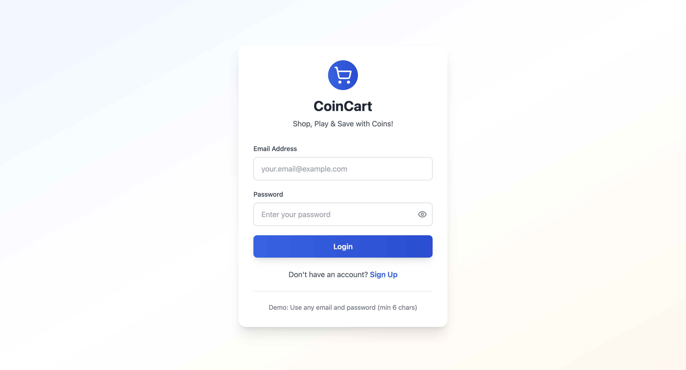
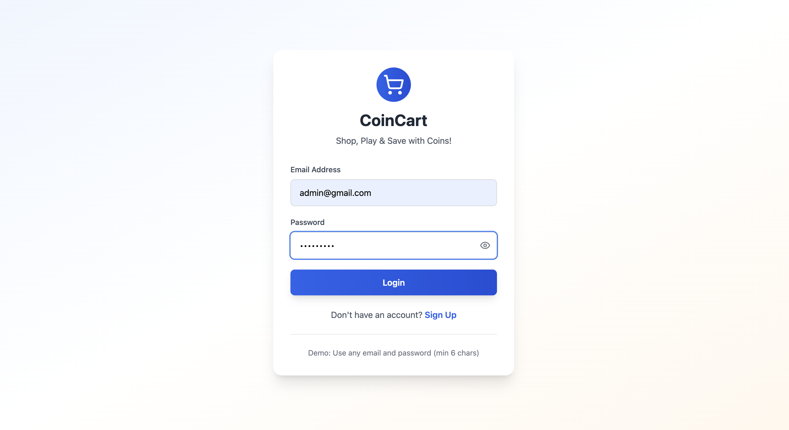
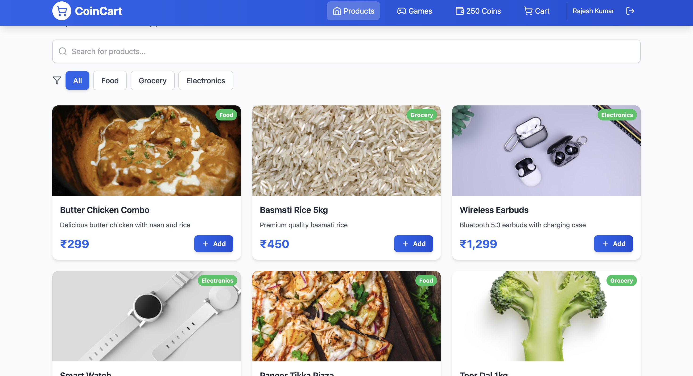
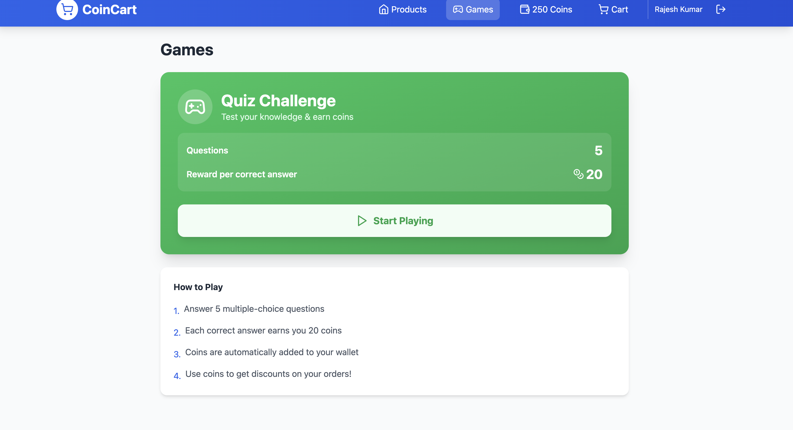
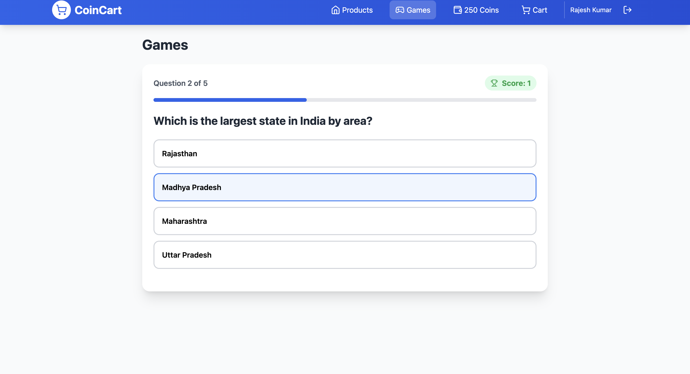
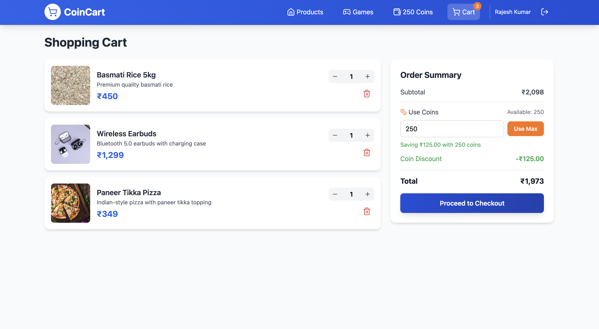
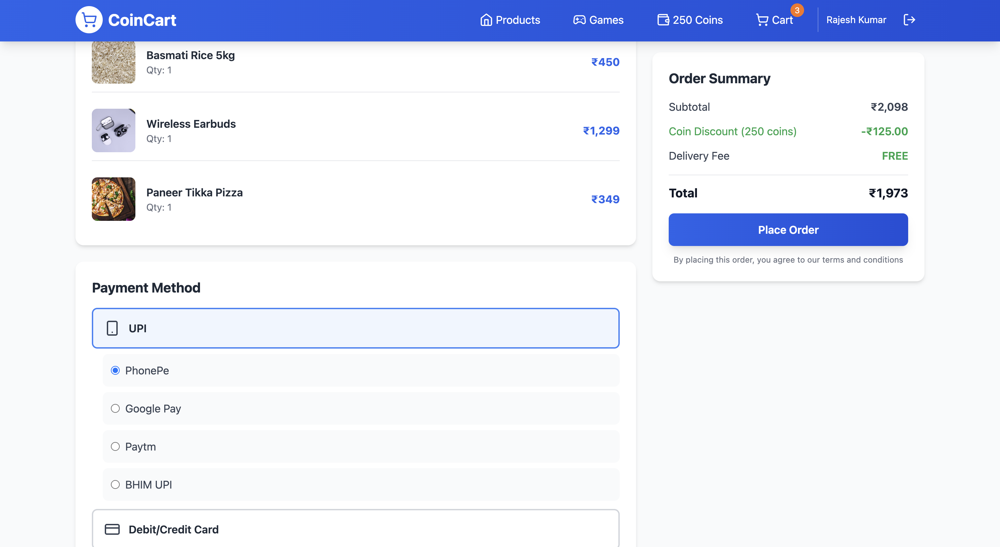

# 🛒 CoinCart — Gamified Delivery App 🎮

CoinCart is a **gamified e-commerce delivery app** where users can order products, play quizzes, and **earn coins** that can be redeemed for discounts.  
The goal of CoinCart is to make online shopping **fun, rewarding, and engaging**.

Designed using **Bolt** with cloud-based storage and object-oriented design principles.

---

## ✨ Key Features

- 🛍 Browse products and add to cart
- 🎯 Play engaging quizzes to earn bonus coins
- 💰 Earn & redeem coins for rewards and discounts
- 🔐 Simple user flow with cart and checkout system
- 🧩 Gamified experience to boost user retention
- 📦 Order confirmation and payment method options

---

## 🔥 Gamification Loop

> **Add to Cart → Play Quiz → Earn Coins → Get Rewards → Order Again ✅**

This encourages continuous engagement and fun while ordering.

---

## 🧱 Tech Stack

| Layer | Technology |
|------|------------|
| UI / Screens | Bolt |
| Architectural Style | Object-Oriented Concepts |
| Deployment | Public Cloud |
| Database | Bolt Cloud Storage / Backend Service |

✅ No local backend required — everything runs in the cloud  
✅ Works on a public server environment

---

## 🧠 Object-Oriented Concepts Used

| OOP Concept | How it’s used in CoinCart |
|------------|--------------------------|
| **Classes & Objects** | Product, Cart items, Order flow represented as components |
| **Encapsulation** | Data like price, quantity, and coin values protected within objects |
| **Inheritance** | Shared UI behaviors reused across pages/components |
| **Polymorphism** | Same functions operating differently e.g., UI button logic varies by screen |
| **Abstraction** | Users interact with simple UI while complex logic is hidden |

> Even in a low-code platform like Bolt, these OOP principles apply in component design and logic reusability.

---

## 📸 Screenshots

| Screen | Screenshot | Description |
|--------|-----------|-------------|
| Opening Page |  | App starting interface |
| Input Page |  | Initial user interaction / input fields |
| Home / Products |  | Product catalog with shopping options |
| Quiz Page |  | Gamified quiz section |
| Quiz Attempt |  | User answering quiz questions |
| Cart Page |  | Selected products checkout view |
| Payment Options |  | Select payment method |
| Order Placed |  | Final confirmation screen ✅ |

> All screenshots may be viewed clearly in the repository for better detail.

---

## 🎮 How It Works

1️⃣ User opens CoinCart  
2️⃣ Adds products to cart  
3️⃣ Plays quiz to **gain coins**  
4️⃣ Applies discounts using earned coins  
5️⃣ Completes order with selected payment method  
6️⃣ Order success screen 🎉

---

## 🚀 Project Goals

- Improve user engagement in online shopping
- Explore **gamification in e-commerce**
- Build full ordering flow using UI logic
- Demonstrate OOP principles even in low-code environment

---

## 📌 Future Enhancements

- ✅ Live order tracking
- ✅ Leaderboard for quiz scores
- 🔐 Authentication, login system
- 📱 Native mobile app version
- 💳 Add secure payment gateway integrations
- 🪙 NFTs / premium rewards using coins

---

## 👨‍💻 Author

**Azmil Mohammed K S**  
B.Tech Mini Project — built in free time for creativity and fun 🎯

---

## 📜 License

MIT License
